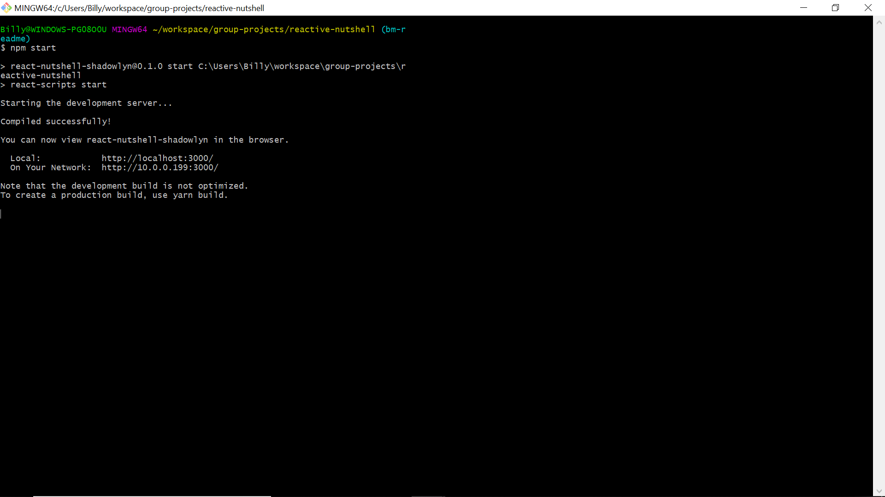
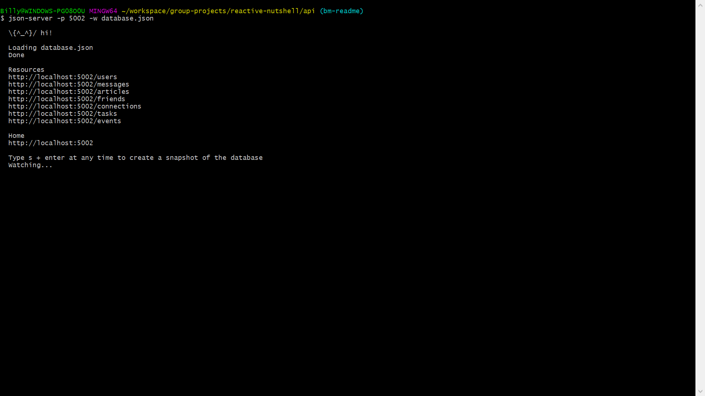

# NutShell

Welcome to Nutshell. It is a social platform that allows users to set tasks for themselves, create, update and delete news articles and events and also see that of your friends. Not only can you add more friends, but delete them when those ties fall sour. Users are also able to communicate with one another through the ChatRoom we created. Users are able to create, read, and edit their more current messages. We hope you enjoy our application!

## Getting Started

These instructions will get you a copy of the project up and running on your local machine

### Installing

First, you'll need to clone down the repo into a directory. Open your terminal and enter

```
git clone git@github.com:c31-swynlake/reactive-nutshell.git
```

After that, open up your editor. You're going to need to do the following:
+ 1. go into the `api/database.json.example` file  
+ 2. Cmd + A (on Mac) or Ctrl + A (on Windows) to copy all of the example database
+ 3. While in the `api` directory, make a new file and call it `database.json`
+ 4. Cmd + V (on Mac) or Ctrl + V (on Windows) to paste `database.json.example` into `database.json`

Now, since you have an actual database.json, go back to your terminal, enter the command

```
cd src/
```

You will need to install node modules, run the command

```
npm install
```

Now, you are ready to run the application. In the terminal, run the following command

```
npm start
```

Your terminal should look similar to this, with no read errors: 



You will need to open a new terminal window. After doing so, go to your directory and run the following command

```
cd /api
```

Now you will need to launch your json-server. Run the following

```
json-server -p 5002 -w database.json
```

Your terminal should look similar to this, with no read errors: 


Now go to the page which was automatically launched by npm start


###### You are now ready to use NutShell. 


## First Time User instructions
* The first thing you have to do is register as new user otherwise you will not be able to use NutShell
* Once registered, you will need to login before you are able to use the application
* Since there are only a few people in the database, you need more friends.
+ Clicking on the Add Friend in the friends section, you can add these 6 users (the are current users: AlexT, JamekaE, JonS, BillyM, ChrisM, BrianJ)
* Another way is to go to the chat room and click on a user beside their message and add them. 
* You now have friends. 
* At this point, you can explore your dashboard, enter a new task, article, events. You are able to see your friends events and articles as well. 
* While you're at it, if you want to go to the chat room with out any noise, go the navigation bar and click on the messages tab. You'll see just that, the chat room. 


### We hope you enjoyed our app! :)


## Built With

* [React](https://reactjs.org/) - The language we used
* [reactstrap](https://reactstrap.github.io/) - Used for styling


## Authors

* **Jameka Echols** 
* **Brian Jobe** 
* **Billy Mathison** 


## Acknowledgments

* Inspiration
* [PurpleBooth](https://gist.githubusercontent.com/PurpleBooth/109311bb0361f32d87a2/raw/8254b53ab8dcb18afc64287aaddd9e5b6059f880/README-Template.md) - For their template
